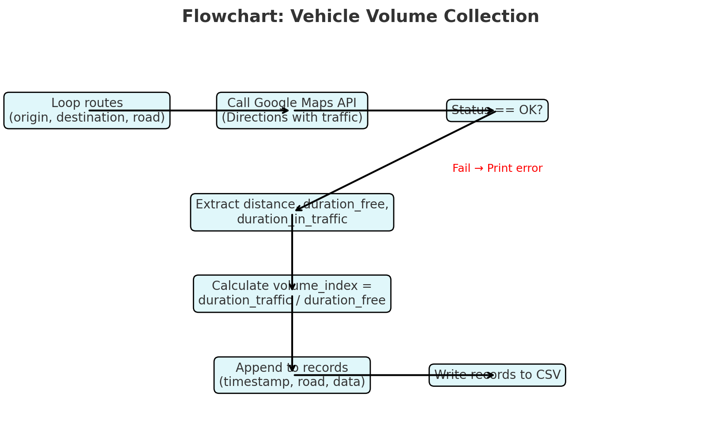

# vehicle-traffic-jakarta

jupyter notebook - python

using colab is easier than running in local, but both are fine, choose whichever you prefer.

workflow
1. install package like requests, follium, plotly, seaborn
2. prepare your api key google, coz the dataset realtime and need the maping concept by google, but if you have another api is ok to implement it but some function is different
3. set area on maps using lat and lng
4. hit api google directions (params: origin destination, departure time=now, apikey)
5. get information from json --> distance, duration_fee, duration_in_traffic
6. volume index : 
volume_index = round(duration_traffic / duration_free, 2)

if <= 1.0 --> smooth traffic (real-time travel time is the same as normal)
else --> congestion, and the higher the value, the heavier the traffic

flowchart

